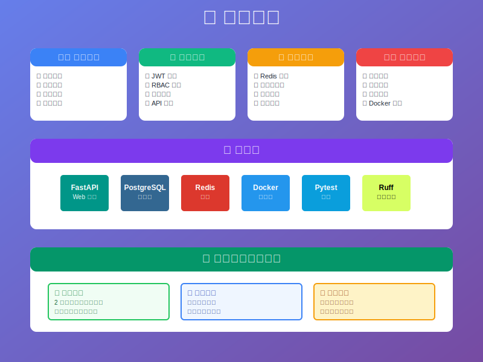
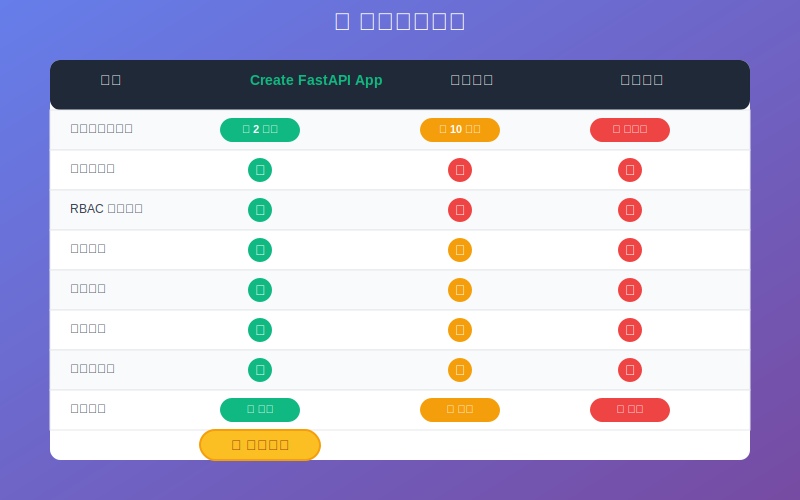

<div align="center">

### 🌟 如果这个项目对你有帮助，请给个 Star！

# 🚀 Create FastAPI App

<p align="center">
  
  
  
</p>

<p align="center">
  
  
  
</p>

<h3>🎯 一键创建生产级 FastAPI 项目</h3>

<p align="center">
  <strong>基于 <a href="https://github.com/JiayuXu0/FastAPI-Template">FastAPI-Template</a> (200+ ⭐) 的企业级项目生成器</strong>
</p>

<p align="center">
  <a href="#-特性">特性</a> •
  <a href="#-快速开始">快速开始</a> •
  <a href="#-演示">演示</a> •
  <a href="#-为什么选择">为什么选择</a> •
  <a href="#-配置选项">配置选项</a>
</p>

</div>

---

## 🎬 演示

<div align="center">
  
</div>

## ✨ 特性

<div align="center">
  
</div>


## 🚀 快速开始

### 安装

```bash
pip install cookiecutter
```

### 创建项目

```bash
cookiecutter https://github.com/JiayuXu0/create-fastapi-app
```

### 交互式配置

```bash
project_name [My FastAPI Project]: Awesome API
project_slug [awesome-api]: 
project_description [企业级FastAPI后端项目]: 高性能微服务API
author_name [Your Name]: John Doe
author_email [your.email@example.com]: john@example.com
github_username [yourusername]: johndoe
Select database_type:
1 - postgresql
2 - sqlite
Choose from 1, 2 [1]: 1
Select use_redis:
1 - yes
2 - no
Choose from 1, 2 [1]: 1
```

### 启动项目

```bash
cd awesome-api
cp .env.example .env
uv sync --dev
uv run aerich init-db
uv run uvicorn src:app --reload
```

🎉 **完成！** 访问 http://localhost:8000/docs 查看 API 文档

## 🎯 为什么选择 Create FastAPI App？

<div align="center">
  
</div>

### 🆚 对比其他模板

| 特性 | Create FastAPI App | 普通模板 | 从零开始 |
|-----|-------------------|----------|----------|
| 项目初始化时间 | ⚡ 2 分钟 | 🐢 10 分钟 | 🐌 数小时 |
| 企业级架构 | ✅ 内置 | ❌ 需自行设计 | ❌ 需自行设计 |
| RBAC 权限系统 | ✅ 开箱即用 | ❌ 需要开发 | ❌ 需要开发 |
| 生产就绪 | ✅ 完全就绪 | ⚠️ 需要调整 | ❌ 大量工作 |
| 最佳实践 | ✅ 遵循标准 | ⚠️ 参差不齐 | ❌ 容易踩坑 |

### 💡 适用场景

- 🏢 **企业级应用** - 需要完整权限管理的系统
- 🚀 **快速原型** - 快速验证业务想法
- 📚 **学习项目** - 学习 FastAPI 最佳实践
- 🔧 **微服务** - 构建微服务架构的基础

## 📋 配置选项

### 基本配置

| 配置项 | 说明 | 默认值 |
|--------|------|--------|
| `project_name` | 项目名称 | My FastAPI Project |
| `project_slug` | 项目标识符（URL友好） | 自动生成 |
| `project_description` | 项目描述 | 企业级FastAPI后端项目 |
| `author_name` | 作者姓名 | Your Name |
| `author_email` | 作者邮箱 | your.email@example.com |

### 技术选择

| 配置项 | 选项 | 说明 |
|--------|------|------|
| `database_type` | postgresql, sqlite | 数据库类型 |
| `use_redis` | yes, no | 是否使用 Redis 缓存 |
| `include_docs` | yes, no | 是否包含 MkDocs 文档 |
| `python_version` | 3.11, 3.12 | Python 版本 |

## 📁 生成的项目结构

```
awesome-api/
├── 📄 README.md                 # 项目说明文档
├── 🐳 Dockerfile                # Docker 配置
├── 📋 pyproject.toml            # 项目依赖配置
├── 🔧 .env.example              # 环境变量示例
├── 📂 src/                      # 源代码目录
│   ├── 🌐 api/v1/              # API 路由层
│   ├── 💼 services/            # 业务逻辑层
│   ├── 🗄️ repositories/        # 数据访问层
│   ├── 📊 models/              # 数据模型
│   ├── ✅ schemas/             # 验证模式
│   ├── 🔧 core/                # 核心功能
│   └── 🛠️ utils/               # 工具函数
├── 🧪 tests/                   # 测试目录
├── 📚 docs/                    # 项目文档
└── 🔄 migrations/              # 数据库迁移
```


## 🤝 贡献

欢迎贡献！请查看 [贡献指南](CONTRIBUTING.md) 了解如何开始。

## 📄 许可证

本项目基于 MIT 许可证开源 - 查看 [LICENSE](LICENSE) 文件了解详情。

## 🙏 致谢

- 🌟 [FastAPI-Template](https://github.com/JiayuXu0/FastAPI-Template) - 核心模板
- 🍪 [Cookiecutter](https://github.com/cookiecutter/cookiecutter) - 项目生成器
- ⚡ [FastAPI](https://fastapi.tiangolo.com/) - Web 框架